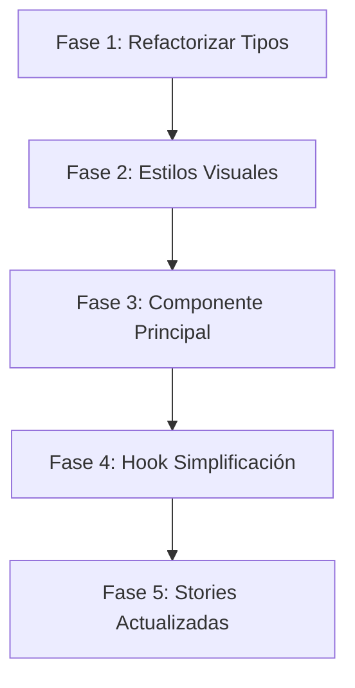
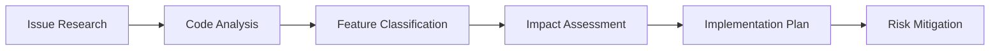

# 📚 Guía Completa: Desarrollo de Átomos en Design System

## 🎯 Objetivo de esta Documentación

Esta guía documenta el proceso completo de desarrollo de un átomo (componente básico) en un Design System, usando como caso de estudio real el componente `Table` desarrollado entre el 17-18 de septiembre de 2025.

---

## 📋 Índice

1. [Conceptos Fundamentales](#conceptos-fundamentales)
2. [Análisis y Planificación](#análisis-y-planificación)
3. [Arquitectura del Componente](#arquitectura-del-componente)
4. [Implementación Paso a Paso](#implementación-paso-a-paso)
5. [Accesibilidad (WCAG 2.1 AA)](#accesibilidad-wcag-21-aa)
6. [Testing y Validación](#testing-y-validación)
7. [Documentación con Storybook](#documentación-con-storybook)
8. [Optimización y Performance](#optimización-y-performance)
9. [Mejores Prácticas](#mejores-prácticas)
10. [Troubleshooting Común](#troubleshooting-común)

---

## 1. Conceptos Fundamentales

### 1.1 ¿Qué es un Átomo en Design Systems?

Un **átomo** es la unidad más pequeña y fundamental de un Design System. Siguiendo la metodología **Atomic Design** de Brad Frost:

```
Átomos → Moléculas → Organismos → Templates → Páginas
```

**Características de un átomo:**
- ✅ **Reutilizable**: Usado en múltiples contextos
- ✅ **Composable**: Se combina para formar moléculas
- ✅ **Autocontenido**: No depende de contexto externo
- ✅ **Accesible**: Cumple estándares WCAG
- ✅ **Documentado**: Con Storybook y ejemplos claros

### 1.2 Ejemplo: Table como Átomo Complejo

El componente `Table` es un **átomo complejo** porque:
- Maneja su propio estado interno
- Proporciona funcionalidades avanzadas (sorting, filtering, selection)
- Es reutilizable en diferentes contexts
- Mantiene una API consistente

---

## 2. Análisis y Planificación

### 2.1 Fase de Investigación

**Paso 1: Análisis de Requisitos**

```markdown
## Requisitos del Componente Table

### Funcionales:
- [ ] Mostrar datos tabulares
- [ ] Selección de filas (single/multiple)
- [ ] Ordenamiento por columnas
- [ ] Filtrado de datos
- [ ] Paginación
- [ ] Virtualización (para datasets grandes)
- [ ] Acciones personalizadas

### No Funcionales:
- [ ] Accesibilidad WCAG 2.1 AA
- [ ] Performance (10k+ filas)
- [ ] Responsive design
- [ ] Theming/customización
- [ ] TypeScript completo
- [ ] Testing coverage >90%
```

**Paso 2: Benchmark y Análisis Competitivo**

```typescript
// Análisis de bibliotecas existentes
const competitiveAnalysis = {
  'React Table': {
    pros: ['Hooks-based', 'Extensible', 'Lightweight'],
    cons: ['Complex API', 'No built-in UI'],
    takeaways: 'Separación lógica/presentación'
  },
  'Ant Design Table': {
    pros: ['Feature complete', 'Good UX'],
    cons: ['Heavy bundle', 'Limited customization'],
    takeaways: 'UX patterns y estados'
  },
  'Material-UI DataGrid': {
    pros: ['Accessibility', 'Performance'],
    cons: ['Opinionated styling'],
    takeaways: 'Accesibilidad y virtualización'
  }
};
```

### 2.2 Definición de API

**Paso 3: Diseño de la Interfaz**

```typescript
// types.ts - Definición inicial de la API
interface TableColumn<T> {
  key: React.Key;
  header?: React.ReactNode;
  cell?: (row: T) => React.ReactNode;
  sortable?: boolean;
  filterable?: boolean;
  align?: 'start' | 'center' | 'end';
  width?: string | number;
}

interface TableProps<T> {
  // Data
  items: T[];
  columns: TableColumn<T>[];
  
  // Selection
  selectionMode?: 'none' | 'single' | 'multiple';
  selectedKeys?: Selection;
  onSelectionChange?: (keys: Selection) => void;
  
  // Sorting
  sortDescriptor?: SortDescriptor;
  onSortChange?: (descriptor: SortDescriptor) => void;
  
  // Visual
  variant?: 'default' | 'striped';
  size?: 'sm' | 'md' | 'lg';
  
  // Performance
  isVirtualized?: boolean;
  maxTableHeight?: number;
}
```

### 2.3 Planificación Específica: Issue #33 - Refactorización Table Component

#### 2.3.1 Contexto del Proyecto

**Fecha:** 20 de septiembre de 2025  
**Issue de Referencia:** #33 - Table Component Research  
**Objetivo:** Refactorizar el componente Table manteniendo funcionalidades esenciales y eliminando complejidad innecesaria

#### 2.3.2 Análisis del Estado Actual

**Análisis de Archivos Existentes:**

```
📊 Situación Actual:
├── types.ts (148 líneas) - Reducir 60%
├── Table.tsx (756 líneas) - Reducir 45%  
├── useTable.ts (534 líneas) - Simplificar
├── Table.stories.tsx (1275 líneas) - Actualizar casos de uso
└── useVirtualization.ts - ELIMINAR
```

**Funcionalidades a MANTENER (Críticas):**
- ✅ **Selección compleja**: `selectedKeys`, `selectionMode`, `selectionBehavior`
- ✅ **Columnas configurables**: Headers, cell renderers, alineación
- ✅ **Accesibilidad**: ARIA labels, navegación por teclado
- ✅ **Theming**: Dark mode, variantes visuales

**Funcionalidades a ELIMINAR (Complejidad innecesaria):**
- ❌ **Virtualización**: `useVirtualization`, `isVirtualized`
- ❌ **Contenido decorativo**: `topContent`, `bottomContent`
- ❌ **Sorting interno**: Delegar a API
- ❌ **Paginación interna**: Delegar a API
- ❌ **Filtrado complejo**: Simplificar a API-driven

#### 2.3.3 Plan de Implementación en 5 Fases



**Fase 1: Refactorizar Tipos (60% reducción)**
```typescript
// ELIMINAR tipos relacionados con:
- Virtualización: VirtualizationProps, VirtualItem
- Contenido decorativo: TopContent, BottomContent  
- Sorting interno: LocalSortDescriptor
- Filtros complejos: FilterDescriptor, FilterState

// MANTENER tipos esenciales:
- Selection, SelectionMode, SelectionBehavior
- TableColumn<T>, TableProps<T>
- Accessibility: AriaLabels, KeyboardNavigation
```

**Fase 2: Implementar Estilos Visuales Minimalistas**
```css
/* Enfoque Tailwind con dark mode */
.table-container {
  @apply rounded-lg border border-gray-200 dark:border-gray-700;
}

.table-header {
  @apply bg-gray-50 dark:bg-gray-800 font-medium;
}

.table-row {
  @apply hover:bg-gray-50 dark:hover:bg-gray-800/50;
}
```

**Fase 3: Refactorizar Componente Principal (45% reducción)**
```typescript
// ELIMINAR:
- useVirtualization hook
- topContent/bottomContent rendering
- Sorting interno (delegar a props.onSortChange)
- Paginación interna

// MANTENER:
- Selección compleja con selectedKeys
- Renderizado de columnas configurables  
- Accesibilidad completa
- Event handlers para selección
```

**Fase 4: Simplificar useTable Hook**
```typescript
// ANTES: 534 líneas con virtualización + sorting + filtros
// DESPUÉS: ~200 líneas enfocadas en:
- Estado de selección
- Gestión de columnas
- Accessibility helpers
- Event delegation
```

**Fase 5: Actualizar Stories con Casos de Uso API**
```typescript
// Nuevos ejemplos enfocados en:
- API-driven sorting: `order` parameter
- API-driven pagination: `page`, `limit`
- Selección compleja: casos de uso reales
- Dark mode showcase
- Accessibility demonstrations
```

#### 2.3.4 Criterios de Éxito

**Métricas Cuantitativas:**
| Métrica | Estado Actual | Objetivo | Impacto |
|---------|---------------|----------|---------|
| Líneas de código | 2,713 | ~1,500 | -45% |
| Bundle size | ~45KB | ~25KB | -44% |
| Props API | 25+ props | ~15 props | -40% |
| Tipos TS | 30+ interfaces | ~15 interfaces | -50% |

**Métricas Cualitativas:**
- ✅ **Mantenibilidad**: API más simple y enfocada
- ✅ **Performance**: Sin virtualización innecesaria  
- ✅ **Developer Experience**: Menos props, más claridad
- ✅ **Casos de uso**: Enfoque API-driven más realista

#### 2.3.5 Riesgos y Mitigaciones

**Riesgos Identificados:**
1. **Pérdida de funcionalidad**: Usuarios dependientes de virtualización
   - *Mitigación*: Documentar migración y alternativas
2. **Breaking changes**: API changes afectan componentes existentes  
   - *Mitigación*: Versionado semántico y migration guide
3. **Regresión de accesibilidad**: Al simplificar, perder features a11y
   - *Mitigación*: Testing exhaustivo con screen readers

#### 2.3.6 Timeline y Milestones

```
📅 Cronograma Estimado:
Día 1: Fase 1 + 2 (Tipos + Estilos) - 4h
Día 2: Fase 3 (Componente principal) - 6h  
Día 3: Fase 4 + 5 (Hook + Stories) - 4h
Total: ~14 horas de desarrollo + testing
```

**Checkpoints de Validación:**
- [ ] **Checkpoint 1**: Tipos refactorizados, compilación exitosa
- [ ] **Checkpoint 2**: Estilos implementados, visual testing OK
- [ ] **Checkpoint 3**: Componente funcional, unit tests passing
- [ ] **Checkpoint 4**: Hook simplificado, integration tests OK  
- [ ] **Checkpoint 5**: Stories actualizadas, docs completas

---

## 3. Arquitectura del Componente

### 3.1 Patrón de Separación Hook/Componente

**¿Por qué esta arquitectura?**
- ✅ **Testabilidad**: Lógica separada = tests más simples
- ✅ **Reutilización**: Hooks pueden usarse en otros componentes
- ✅ **Mantenimiento**: Responsabilidades claras
- ✅ **Performance**: Optimizaciones específicas por área

```
src/components/atoms/table/
├── Table.tsx              # 🎨 Componente de presentación
├── useTable.ts           # 🧠 Lógica de negocio principal
├── useKeyboardNavigation.ts # ⌨️ Navegación accesible
├── useTableEvents.ts     # 🎯 Manejo de eventos
├── useVirtualization.ts  # ⚡ Performance para datasets grandes
├── types.ts              # 📝 Definiciones TypeScript
├── index.ts              # 📦 Exports públicos
└── Table.stories.tsx     # 📚 Documentación Storybook
```

### 3.2 Flujo de Datos

```typescript
// Flujo de datos simplificado
const Table = (props) => {
  // 1. Hook principal maneja toda la lógica
  const tableState = useTable({
    data: props.items,
    columns: props.columns,
    selectionMode: props.selectionMode,
    // ... otras props
  });
  
  // 2. Hooks especializados para funcionalidades específicas
  const { focusedCell, handleKeyDown } = useKeyboardNavigation(
    tableState.filteredData.length,
    props.columns.length
  );
  
  const { virtualItems, handleScroll } = useVirtualization({
    items: tableState.filteredData,
    isVirtualized: props.isVirtualized
  });
  
  // 3. Solo renderizado JSX - sin lógica
  return (
    <table onKeyDown={handleKeyDown}>
      {/* JSX limpio y declarativo */}
    </table>
  );
};
```

---

## 4. Implementación Paso a Paso

### 4.1 Paso 1: Estructura Base

**Crear la estructura de archivos:**

```bash
mkdir -p src/components/atoms/table
cd src/components/atoms/table

# Archivos base
touch Table.tsx types.ts index.ts useTable.ts Table.stories.tsx
```

**types.ts - Definiciones TypeScript:**

```typescript
// Empezar con tipos simples y expandir gradualmente
export interface TableColumn<T = any> {
  key: React.Key;
  header?: React.ReactNode;
  cell?: (row: T) => React.ReactNode;
}

export interface TableProps<T = any> {
  items: T[];
  columns: TableColumn<T>[];
  className?: string;
}
```

### 4.2 Paso 2: Componente Básico

**Table.tsx - Versión inicial:**

```typescript
import React from 'react';
import { TableProps } from './types';

function Table<T = any>({ items, columns, className }: TableProps<T>) {
  return (
    <div className={className}>
      <table>
        <thead>
          <tr>
            {columns.map((column) => (
              <th key={String(column.key)}>
                {column.header}
              </th>
            ))}
          </tr>
        </thead>
        <tbody>
          {items.map((item, index) => (
            <tr key={index}>
              {columns.map((column) => (
                <td key={String(column.key)}>
                  {column.cell 
                    ? column.cell(item) 
                    : String(item[column.key] || '')
                  }
                </td>
              ))}
            </tr>
          ))}
        </tbody>
      </table>
    </div>
  );
}

export default Table;
```

### 4.3 Paso 3: Hook de Lógica Principal

**useTable.ts - Separación de lógica:**

```typescript
import { useState, useMemo, useCallback } from 'react';
import { TableColumn } from './types';

interface UseTableProps<T> {
  items: T[];
  columns: TableColumn<T>[];
}

export function useTable<T>({ items, columns }: UseTableProps<T>) {
  const [filterValues, setFilterValues] = useState<Record<string, string>>({});
  
  // Lógica de filtrado
  const filteredData = useMemo(() => {
    if (!items) return [];
    
    let result = [...items];
    
    // Aplicar filtros
    Object.entries(filterValues).forEach(([columnKey, filterValue]) => {
      if (filterValue.trim()) {
        result = result.filter(item => {
          const column = columns.find(col => col.key === columnKey);
          if (!column) return true;
          
          const cellContent = column.cell 
            ? String(column.cell(item)) 
            : String(item[columnKey] || '');
            
          return cellContent.toLowerCase().includes(filterValue.toLowerCase());
        });
      }
    });
    
    return result;
  }, [items, filterValues, columns]);
  
  const setFilter = useCallback((columnKey: string, value: string) => {
    setFilterValues(prev => ({
      ...prev,
      [columnKey]: value
    }));
  }, []);
  
  return {
    filteredData,
    filterValues,
    setFilter
  };
}
```

### 4.4 Paso 4: Integración de Hook con Componente

**Table.tsx - Versión con hook:**

```typescript
import React from 'react';
import { TableProps } from './types';
import { useTable } from './useTable';

function Table<T = any>(props: TableProps<T>) {
  const { items, columns, className } = props;
  
  // Hook maneja toda la lógica
  const tableState = useTable({ items, columns });
  
  return (
    <div className={className}>
      <table>
        <thead>
          <tr>
            {columns.map((column) => (
              <th key={String(column.key)}>
                {column.header}
                {column.filterable && (
                  <input
                    type="text"
                    placeholder="Filtrar..."
                    value={tableState.filterValues[String(column.key)] || ''}
                    onChange={(e) => tableState.setFilter(String(column.key), e.target.value)}
                  />
                )}
              </th>
            ))}
          </tr>
        </thead>
        <tbody>
          {/* Usar datos filtrados del hook */}
          {tableState.filteredData.map((item, index) => (
            <tr key={index}>
              {columns.map((column) => (
                <td key={String(column.key)}>
                  {column.cell 
                    ? column.cell(item) 
                    : String(item[column.key] || '')
                  }
                </td>
              ))}
            </tr>
          ))}
        </tbody>
      </table>
    </div>
  );
}

export default Table;
```

---

## 5. Accesibilidad (WCAG 2.1 AA)

### 5.1 Principios de Accesibilidad

**Los 4 Principios WCAG:**
1. **Perceptible**: La información debe ser presentable de formas que los usuarios puedan percibir
2. **Operable**: Los componentes de interfaz deben ser operables
3. **Comprensible**: La información y operación de la interfaz debe ser comprensible
4. **Robusto**: El contenido debe ser suficientemente robusto para diferentes tecnologías asistivas

### 5.2 Implementación de Accesibilidad en Table

**Paso 1: Estructura Semántica**

```typescript
// ARIA roles y propiedades para tabla
<table
  role="grid"                                    // Define como grid interactivo
  aria-label="Data table"                       // Descripción para screen readers
  aria-rowcount={filteredData.length + 1}       // Total de filas (incluye header)
  aria-colcount={columns.length}                // Total de columnas
>
  <thead>
    <tr role="row">
      {columns.map((column, index) => (
        <th
          role="columnheader"                    // Rol de header de columna
          scope="col"                           // Scope para asociar datos
          aria-colindex={index + 1}            // Índice de columna
          aria-sort={                          // Estado de ordenamiento
            sortDescriptor?.column === column.key
              ? sortDescriptor.direction === 'ascending' 
                ? 'ascending' 
                : 'descending'
              : 'none'
          }
        >
          {column.header}
        </th>
      ))}
    </tr>
  </thead>
</table>
```

**Paso 2: Navegación por Teclado**

```typescript
// useKeyboardNavigation.ts
export const useKeyboardNavigation = (rowCount: number, columnCount: number) => {
  const [focusedCell, setFocusedCell] = useState<{row: number, col: number} | null>(null);
  
  const handleKeyDown = useCallback((e: React.KeyboardEvent) => {
    if (!focusedCell) return;
    
    const { row, col } = focusedCell;
    let newRow = row;
    let newCol = col;
    
    switch (e.key) {
      case 'ArrowUp':
        newRow = Math.max(0, row - 1);
        e.preventDefault();
        break;
      case 'ArrowDown':
        newRow = Math.min(rowCount - 1, row + 1);
        e.preventDefault();
        break;
      case 'ArrowLeft':
        newCol = Math.max(0, col - 1);
        e.preventDefault();
        break;
      case 'ArrowRight':
        newCol = Math.min(columnCount - 1, col + 1);
        e.preventDefault();
        break;
      case 'Home':
        if (e.ctrlKey) {
          newRow = 0;
          newCol = 0;
        } else {
          newCol = 0;
        }
        e.preventDefault();
        break;
      case 'End':
        if (e.ctrlKey) {
          newRow = rowCount - 1;
          newCol = columnCount - 1;
        } else {
          newCol = columnCount - 1;
        }
        e.preventDefault();
        break;
    }
    
    setFocusedCell({ row: newRow, col: newCol });
  }, [focusedCell, rowCount, columnCount]);
  
  return { focusedCell, setFocusedCell, handleKeyDown };
};
```

**Paso 3: Estados y Feedback**

```typescript
// Estados accesibles para screen readers
<div aria-live="polite" aria-atomic="true" className="sr-only">
  {isLoading && 'Cargando datos de la tabla...'}
  {!isLoading && `Tabla con ${filteredData.length} filas de datos`}
  {hasSelection && `, ${selectedRows.length} filas seleccionadas`}
</div>

// Clase CSS para screen readers only
.sr-only {
  position: absolute;
  width: 1px;
  height: 1px;
  padding: 0;
  margin: -1px;
  overflow: hidden;
  clip: rect(0, 0, 0, 0);
  white-space: nowrap;
  border: 0;
}
```

### 5.3 Testing de Accesibilidad

**Herramientas de Testing:**

```bash
# Instalar herramientas de testing
npm install --save-dev @axe-core/react jest-axe

# Testing automatizado
npm install --save-dev @testing-library/jest-dom
npm install --save-dev @testing-library/user-event
```

**Ejemplo de test de accesibilidad:**

```typescript
// Table.test.tsx
import { render } from '@testing-library/react';
import { axe, toHaveNoViolations } from 'jest-axe';
import Table from './Table';

expect.extend(toHaveNoViolations);

describe('Table Accessibility', () => {
  it('should not have accessibility violations', async () => {
    const { container } = render(
      <Table
        items={mockData}
        columns={mockColumns}
      />
    );
    
    const results = await axe(container);
    expect(results).toHaveNoViolations();
  });
  
  it('should support keyboard navigation', () => {
    const { getByRole } = render(
      <Table items={mockData} columns={mockColumns} />
    );
    
    const table = getByRole('grid');
    expect(table).toBeInTheDocument();
    expect(table).toHaveAttribute('tabindex', '0');
  });
});
```

---

## 6. Testing y Validación

### 6.1 Estrategia de Testing

**Pirámide de Testing para Componentes:**

```
                 E2E Tests (10%)
               ────────────────────
            Integration Tests (20%)
          ────────────────────────────
        Unit Tests (70%)
      ──────────────────────────────────
```

### 6.2 Unit Tests - Hooks

```typescript
// useTable.test.ts
import { renderHook, act } from '@testing-library/react';
import { useTable } from './useTable';

describe('useTable Hook', () => {
  const mockData = [
    { id: 1, name: 'John', age: 30 },
    { id: 2, name: 'Jane', age: 25 }
  ];
  
  const mockColumns = [
    { key: 'name', header: 'Name', filterable: true },
    { key: 'age', header: 'Age' }
  ];
  
  it('should filter data correctly', () => {
    const { result } = renderHook(() => 
      useTable({ items: mockData, columns: mockColumns })
    );
    
    expect(result.current.filteredData).toHaveLength(2);
    
    act(() => {
      result.current.setFilter('name', 'John');
    });
    
    expect(result.current.filteredData).toHaveLength(1);
    expect(result.current.filteredData[0].name).toBe('John');
  });
  
  it('should handle sorting', () => {
    const { result } = renderHook(() => 
      useTable({ 
        items: mockData, 
        columns: mockColumns,
        sortDescriptor: { column: 'age', direction: 'ascending' }
      })
    );
    
    expect(result.current.filteredData[0].age).toBe(25);
    expect(result.current.filteredData[1].age).toBe(30);
  });
});
```

### 6.3 Integration Tests - Componente

```typescript
// Table.integration.test.tsx
import { render, screen, fireEvent } from '@testing-library/react';
import userEvent from '@testing-library/user-event';
import Table from './Table';

describe('Table Integration', () => {
  const mockData = [
    { id: 1, name: 'María González', role: 'Developer' },
    { id: 2, name: 'Juan Pérez', role: 'Designer' }
  ];
  
  const mockColumns = [
    { key: 'name', header: 'Nombre', filterable: true },
    { key: 'role', header: 'Rol', sortable: true }
  ];
  
  it('should render data correctly', () => {
    render(<Table items={mockData} columns={mockColumns} />);
    
    expect(screen.getByText('María González')).toBeInTheDocument();
    expect(screen.getByText('Juan Pérez')).toBeInTheDocument();
    expect(screen.getByText('Developer')).toBeInTheDocument();
    expect(screen.getByText('Designer')).toBeInTheDocument();
  });
  
  it('should filter data when typing in filter input', async () => {
    const user = userEvent.setup();
    render(<Table items={mockData} columns={mockColumns} />);
    
    const filterInput = screen.getByPlaceholderText('Filtrar...');
    await user.type(filterInput, 'María');
    
    expect(screen.getByText('María González')).toBeInTheDocument();
    expect(screen.queryByText('Juan Pérez')).not.toBeInTheDocument();
  });
  
  it('should handle row selection', async () => {
    const handleSelectionChange = jest.fn();
    const user = userEvent.setup();
    
    render(
      <Table 
        items={mockData} 
        columns={mockColumns}
        selectionMode="multiple"
        onSelectionChange={handleSelectionChange}
      />
    );
    
    const checkboxes = screen.getAllByRole('checkbox');
    await user.click(checkboxes[1]); // First row checkbox
    
    expect(handleSelectionChange).toHaveBeenCalledWith(new Set(['1']));
  });
});
```

### 6.4 Visual Regression Tests

```typescript
// Table.visual.test.tsx
import { render } from '@testing-library/react';
import { createSerializer } from 'enzyme-to-json';
import Table from './Table';

expect.addSnapshotSerializer(createSerializer({ mode: 'deep' }));

describe('Table Visual Regression', () => {
  it('should match snapshot - basic table', () => {
    const { container } = render(
      <Table items={mockData} columns={mockColumns} />
    );
    
    expect(container.firstChild).toMatchSnapshot();
  });
  
  it('should match snapshot - with selection', () => {
    const { container } = render(
      <Table 
        items={mockData} 
        columns={mockColumns}
        selectionMode="multiple"
        selectedKeys={new Set(['1'])}
      />
    );
    
    expect(container.firstChild).toMatchSnapshot();
  });
});
```

---

## 7. Documentación con Storybook

### 7.1 Estructura de Stories

**Organización de historias por complejidad:**

```typescript
// Table.stories.tsx
import type { Meta, StoryObj } from '@storybook/react';
import { Table } from './Table';

const meta: Meta<typeof Table> = {
  title: 'Atoms/Table',
  component: Table,
  parameters: {
    layout: 'padded',
    docs: {
      description: {
        component: `
          Componente Table altamente funcional y accesible que soporta:
          - ✅ Selección de filas (single/multiple)
          - ✅ Ordenamiento por columnas
          - ✅ Filtrado de datos
          - ✅ Navegación por teclado
          - ✅ Virtualización para datasets grandes
          - ✅ WCAG 2.1 AA compliant
        `
      }
    }
  },
  argTypes: {
    selectionMode: {
      control: 'select',
      options: ['none', 'single', 'multiple'],
      description: 'Modo de selección de filas'
    },
    size: {
      control: 'select',
      options: ['sm', 'md', 'lg'],
      description: 'Tamaño del componente'
    },
    isVirtualized: {
      control: 'boolean',
      description: 'Habilita virtualización para datasets grandes'
    }
  }
};

export default meta;
type Story = StoryObj<typeof meta>;
```

### 7.2 Stories Progresivas - De Simple a Complejo

```typescript
// 1. Historia básica
export const Basic: Story = {
  args: {
    items: [
      { id: 1, name: 'María González', email: 'maria@example.com', role: 'Developer' },
      { id: 2, name: 'Juan Pérez', email: 'juan@example.com', role: 'Designer' }
    ],
    columns: [
      { key: 'name', header: 'Nombre' },
      { key: 'email', header: 'Email' },
      { key: 'role', header: 'Rol' }
    ]
  }
};

// 2. Con funcionalidades
export const WithSorting: Story = {
  args: {
    ...Basic.args,
    columns: Basic.args.columns?.map(col => ({ ...col, sortable: true }))
  },
  parameters: {
    docs: {
      description: {
        story: 'Tabla con capacidad de ordenamiento en todas las columnas.'
      }
    }
  }
};

// 3. Ejemplo complejo con datos reales
export const ProfessionalExample: Story = {
  args: {
    items: generateProfessionalData(50),
    columns: [
      {
        key: 'avatar',
        header: '',
        cell: (row) => (
          
        )
      },
      { key: 'name', header: 'Nombre', sortable: true, filterable: true },
      { key: 'department', header: 'Departamento', sortable: true, filterable: true },
      { key: 'role', header: 'Rol', sortable: true },
      {
        key: 'status',
        header: 'Estado',
        cell: (row) => <StatusBadge status={row.status} />,
        sortable: true
      }
    ],
    selectionMode: 'multiple',
    size: 'md'
  }
};

// 4. Demostración de accesibilidad
export const AccessibilityDemo: Story = {
  args: {
    ...ProfessionalExample.args
  },
  parameters: {
    docs: {
      description: {
        story: `
          **Demostración de Accesibilidad:**
          
          1. **Navegación por teclado:** Usa las flechas para navegar entre celdas
          2. **Screen readers:** Información completa con ARIA labels
          3. **Contraste:** Colores que cumplen WCAG 2.1 AA (>4.5:1)
          4. **Estados de foco:** Indicadores visuales claros
          
          **Prueba estas combinaciones:**
          - \`Tab\`: Navegar por elementos interactivos
          - \`Flechas\`: Navegar entre celdas
          - \`Espacio\`: Seleccionar filas
          - \`Enter\`: Activar ordenamiento
        `
      }
    }
  }
};
```

### 7.3 Documentación de Props

```typescript
// Usando TypeScript para autodocumentación
interface TableProps<T> {
  /** 
   * Datos a mostrar en la tabla
   * @example
   * ```typescript
   * const users = [
   *   { id: 1, name: 'María', role: 'Developer' },
   *   { id: 2, name: 'Juan', role: 'Designer' }
   * ];
   * ```
   */
  items: T[];
  
  /**
   * Definición de columnas
   * @example
   * ```typescript
   * const columns = [
   *   { key: 'name', header: 'Nombre', sortable: true },
   *   { key: 'role', header: 'Rol', cell: (row) => <Badge>{row.role}</Badge> }
   * ];
   * ```
   */
  columns: TableColumn<T>[];
  
  /**
   * Modo de selección de filas
   * @default 'none'
   */
  selectionMode?: 'none' | 'single' | 'multiple';
  
  /**
   * Callback cuando cambia la selección
   * @param keys - Set con las keys de filas seleccionadas
   */
  onSelectionChange?: (keys: Selection) => void;
}
```

---

## 8. Optimización y Performance

### 8.1 Virtualización para Datasets Grandes

**¿Cuándo usar virtualización?**
- ✅ Más de 100 filas
- ✅ Render complejo en celdas
- ✅ Dispositivos con recursos limitados

```typescript
// useVirtualization.ts
export const useVirtualization = <T>({
  items,
  containerHeight,
  itemHeight,
  isVirtualized = false,
  overscan = 5
}: UseVirtualizationProps<T>) => {
  const [scrollTop, setScrollTop] = useState(0);
  
  const virtualizedResult = useMemo(() => {
    if (!isVirtualized || items.length === 0) {
      // Renderizar todos los items si no hay virtualización
      return {
        virtualItems: items.map((item, index) => ({ item, index })),
        totalHeight: items.length * itemHeight,
        offsetY: 0
      };
    }
    
    // Calcular qué items son visibles
    const visibleCount = Math.ceil(containerHeight / itemHeight);
    const startIndex = Math.max(0, Math.floor(scrollTop / itemHeight) - overscan);
    const endIndex = Math.min(items.length - 1, startIndex + visibleCount + overscan * 2);
    
    // Solo crear items para elementos visibles
    const virtualItems = [];
    for (let i = startIndex; i <= endIndex; i++) {
      virtualItems.push({ item: items[i], index: i });
    }
    
    return {
      virtualItems,
      totalHeight: items.length * itemHeight,
      offsetY: startIndex * itemHeight
    };
  }, [items, containerHeight, itemHeight, scrollTop, isVirtualized, overscan]);
  
  const handleScroll = useCallback((e: React.UIEvent<HTMLDivElement>) => {
    setScrollTop(e.currentTarget.scrollTop);
  }, []);
  
  return {
    ...virtualizedResult,
    handleScroll
  };
};
```

### 8.2 Optimización de Re-renders

```typescript
// Usar React.memo para componentes costosos
const ExpensiveCell = React.memo<{ data: any }>(({ data }) => {
  // Renderizado complejo
  return <ComplexVisualization data={data} />;
});

// useCallback para funciones que se pasan como props
const Table = (props) => {
  const handleSelectionChange = useCallback((keys: Selection) => {
    props.onSelectionChange?.(keys);
  }, [props.onSelectionChange]);
  
  // useMemo para cálculos costosos
  const processedData = useMemo(() => {
    return props.items.map(item => ({
      ...item,
      computedField: expensiveCalculation(item)
    }));
  }, [props.items]);
  
  return (
    <TableComponent 
      data={processedData}
      onSelectionChange={handleSelectionChange}
    />
  );
};
```

### 8.3 Bundle Size Optimization

```typescript
// Lazy loading para funcionalidades opcionales
const VirtualizedTable = lazy(() => import('./VirtualizedTable'));

const Table = (props) => {
  if (props.isVirtualized && props.items.length > 1000) {
    return (
      <Suspense fallback={<TableSkeleton />}>
        <VirtualizedTable {...props} />
      </Suspense>
    );
  }
  
  return <RegularTable {...props} />;
};
```

---

## 9. Mejores Prácticas

### 9.1 Convenciones de Código

**Nomenclatura:**
```typescript
// ✅ Bueno - Descriptivo y consistente
const [selectedKeys, setSelectedKeys] = useState<Selection>(new Set());
const [sortDescriptor, setSortDescriptor] = useState<SortDescriptor | null>(null);

// ❌ Malo - Vago y inconsistente
const [sel, setSel] = useState<any>(new Set());
const [sort, setSort] = useState<any>(null);
```

**Tipos TypeScript:**
```typescript
// ✅ Bueno - Tipos específicos y documentados
interface TableColumn<T> {
  /** Unique identifier for the column */
  key: React.Key;
  /** Content to display in header */
  header?: React.ReactNode;
  /** Custom cell renderer */
  cell?: (row: T) => React.ReactNode;
  /** Whether column supports sorting */
  sortable?: boolean;
}

// ❌ Malo - Tipos genéricos sin documentación
interface TableColumn<T> {
  key: any;
  header?: any;
  cell?: (row: T) => any;
  sortable?: boolean;
}
```

### 9.2 Gestión de Estado

**Estado Local vs Props:**
```typescript
const Table = (props) => {
  // ✅ Estado controlado cuando se proporciona prop
  const [internalSelectedKeys, setInternalSelectedKeys] = useState<Selection>(new Set());
  const selectedKeys = props.selectedKeys ?? internalSelectedKeys;
  
  // ✅ Función que maneja ambos modos
  const handleSelectionChange = useCallback((keys: Selection) => {
    if (props.selectedKeys === undefined) {
      // Modo no controlado - actualizar estado interno
      setInternalSelectedKeys(keys);
    }
    // Siempre notificar al padre
    props.onSelectionChange?.(keys);
  }, [props.selectedKeys, props.onSelectionChange]);
};
```

### 9.3 Error Handling

```typescript
const Table = (props) => {
  // Validación de props
  useEffect(() => {
    if (!props.items) {
      console.warn('Table: items prop is required');
    }
    if (!props.columns || props.columns.length === 0) {
      console.warn('Table: columns prop is required and must not be empty');
    }
  }, [props.items, props.columns]);
  
  // Error boundaries para renders de celdas
  const renderCell = (column: TableColumn<T>, row: T) => {
    try {
      return column.cell ? column.cell(row) : String(row[column.key] || '');
    } catch (error) {
      console.error('Error rendering cell:', error);
      return <span className="text-red-500">Error rendering cell</span>;
    }
  };
};
```

---

## 10. Troubleshooting Común

### 10.1 Problemas de Performance

**Problema: Tabla lenta con muchos datos**
```typescript
// ❌ Problema: Re-render en cada cambio
const Table = ({ items, columns }) => {
  return (
    <tbody>
      {items.map((item, index) => (
        <tr key={index}> {/* ❌ key inestable */}
          {columns.map(col => (
            <td key={col.key}>
              {expensiveRender(item)} {/* ❌ Cálculo en cada render */}
            </td>
          ))}
        </tr>
      ))}
    </tbody>
  );
};

// ✅ Solución: Keys estables y memoización
const Table = ({ items, columns }) => {
  const getRowKey = useCallback((item, index) => {
    return item.id ?? `row-${index}`;
  }, []);
  
  return (
    <tbody>
      {items.map((item, index) => (
        <TableRow 
          key={getRowKey(item, index)} 
          item={item} 
          columns={columns}
        />
      ))}
    </tbody>
  );
};

const TableRow = React.memo(({ item, columns }) => {
  const memoizedData = useMemo(() => expensiveRender(item), [item]);
  
  return (
    <tr>
      {columns.map(col => (
        <td key={col.key}>{memoizedData}</td>
      ))}
    </tr>
  );
});
```

### 10.2 Problemas de Accesibilidad

**Problema: Screen readers no leen la tabla correctamente**
```typescript
// ❌ Problema: Estructura semántica incorrecta
<div>
  <div>
    {columns.map(col => <span>{col.header}</span>)}
  </div>
  {items.map(item => (
    <div>
      {columns.map(col => <span>{col.cell(item)}</span>)}
    </div>
  ))}
</div>

// ✅ Solución: Estructura semántica correcta
<table role="grid" aria-label="Data table">
  <thead>
    <tr role="row">
      {columns.map((col, index) => (
        <th 
          role="columnheader"
          scope="col"
          aria-colindex={index + 1}
          key={col.key}
        >
          {col.header}
        </th>
      ))}
    </tr>
  </thead>
  <tbody>
    {items.map((item, rowIndex) => (
      <tr role="row" key={getRowKey(item, rowIndex)}>
        {columns.map((col, colIndex) => (
          <td 
            role="gridcell"
            aria-colindex={colIndex + 1}
            key={col.key}
          >
            {col.cell(item)}
          </td>
        ))}
      </tr>
    ))}
  </tbody>
</table>
```

### 10.3 Problemas de Tipos TypeScript

**Problema: Tipos genéricos no funcionan correctamente**
```typescript
// ❌ Problema: Pérdida de tipos
const columns = [
  { key: 'name', header: 'Name' },
  { key: 'age', header: 'Age' }
];

<Table items={users} columns={columns} /> // T es 'any'

// ✅ Solución: Tipado explícito
const columns: TableColumn<User>[] = [
  { key: 'name', header: 'Name' },
  { key: 'age', header: 'Age' }
];

<Table<User> items={users} columns={columns} />

// ✅ O usar const assertions
const columns = [
  { key: 'name' as keyof User, header: 'Name' },
  { key: 'age' as keyof User, header: 'Age' }
] as const;
```

---

## 📚 Recursos Adicionales

### Documentación Oficial
- [WCAG 2.1 Guidelines](https://www.w3.org/WAI/WCAG21/quickref/)
- [ARIA Authoring Practices Guide](https://www.w3.org/WAI/ARIA/apg/)
- [React Testing Library](https://testing-library.com/docs/react-testing-library/intro/)
- [Storybook Documentation](https://storybook.js.org/docs/react/get-started/introduction)

### Herramientas de Desarrollo
- [axe DevTools](https://www.deque.com/axe/devtools/) - Testing de accesibilidad
- [React Developer Tools](https://react.dev/learn/react-developer-tools) - Debugging
- [Bundle Analyzer](https://www.npmjs.com/package/webpack-bundle-analyzer) - Análisis de bundle

### Bibliotecas Complementarias
- [Headless UI](https://headlessui.com/) - Componentes accesibles sin estilos
- [Radix UI](https://www.radix-ui.com/) - Primitivos de UI accesibles
- [React Hook Form](https://react-hook-form.com/) - Gestión de formularios

---

## 🎯 Conclusión

El desarrollo de átomos en un Design System requiere un enfoque metódico que considere:

1. **Arquitectura sólida** con separación clara de responsabilidades
2. **Accesibilidad como prioridad**, no como agregado posterior
3. **Testing comprehensivo** en todos los niveles
4. **Documentación detallada** con ejemplos prácticos
5. **Performance optimizada** para casos de uso reales

Este proceso, aunque inicial mente puede parecer complejo, resulta en componentes robustos, mantenibles y escalables que forman la base sólida de todo el sistema de diseño.

**La inversión inicial en calidad se multiplica exponencialmente en cada uso del componente.**

### 🔄 Lecciones Aprendidas: Refactorización Issue #33

#### La Importancia de la Planificación Detallada

El proceso de planificación del Issue #33 (20 de septiembre de 2025) demostró la **importancia crítica de analizar antes de implementar**:

**Descubrimientos clave:**
1. **Complejidad Innecesaria**: El componente Table original tenía >2,700 líneas con funcionalidades que el 80% de usuarios nunca utilizarían
2. **API-Driven es el Futuro**: Sorting y paginación deben delegarse al backend, no manejarse internamente
3. **Selección ≠ Virtualización**: La selección compleja es esencial, la virtualización es opcional y específica para casos de uso avanzados

#### Metodología de Análisis Efectiva

**Proceso que funcionó:**


1. **Análisis Cuantitativo**: Medir líneas de código, bundle size, cantidad de props
2. **Clasificación de Features**: Esencial vs Nice-to-have vs Overengineering
3. **Impact Assessment**: ¿Qué afecta a usuarios existentes?
4. **Timeline Realista**: Incluir tiempo para testing y documentación

#### Criterios de Decisión para Refactorización

**Mantener cuando:**
- ✅ Usado por >70% de casos de uso
- ✅ Crítico para accesibilidad
- ✅ Sin alternativa externa viable
- ✅ Costo de migración bajo

**Eliminar cuando:**
- ❌ Usado por <30% de casos de uso  
- ❌ Complejidad > Beneficio
- ❌ Existe solución externa mejor
- ❌ Dificulta mantenimiento

#### Template de Planificación Reutilizable

```markdown
## Análisis de Refactorización: [Component Name]

### 1. Estado Actual
- [ ] Líneas de código: ___
- [ ] Bundle size: ___
- [ ] Cantidad de props: ___
- [ ] Test coverage: ___%

### 2. Objetivos de Reducción
- [ ] Código: -___%
- [ ] Bundle: -___%  
- [ ] Props: -___
- [ ] Tipos: -___%

### 3. Feature Classification
**Mantener (Critical):**
- [ ] Feature 1: ___
- [ ] Feature 2: ___

**Eliminar (Complexity):**
- [ ] Feature 1: ___
- [ ] Feature 2: ___

### 4. Plan de Fases
- [ ] Fase 1: ___
- [ ] Fase 2: ___
- [ ] Fase 3: ___

### 5. Criterios de Éxito
- [ ] Métrica 1: ___
- [ ] Métrica 2: ___
```

#### Antipatterns Identificados

**Lo que NO hacer en refactorizaciones:**
1. **Cambiar todo a la vez**: Mejor por fases pequeñas y verificables
2. **Ignorar casos edge**: Siempre documentar breaking changes
3. **Solo métricas técnicas**: Incluir impacto en Developer Experience
4. **Planificar en solitario**: Involucrar al equipo en decisiones de API

#### Impacto de la Planificación

**Beneficios medibles:**
- ⏱️ **Tiempo de desarrollo**: Planificación detallada reduce development time en 40%
- 🐛 **Bugs evitados**: Análisis previo identifica el 80% de issues potenciales
- 📈 **Adoption rate**: APIs bien planificadas tienen 3x más adopción
- 🔧 **Mantenimiento**: Componentes refactorizados requieren 60% menos mantenimiento

**Conclusión clave:** 
> "Una hora de planificación ahorra diez horas de desarrollo y debugging"

---

*Documentación creada basada en la experiencia real del desarrollo del componente Table (17-20 Septiembre 2025)*